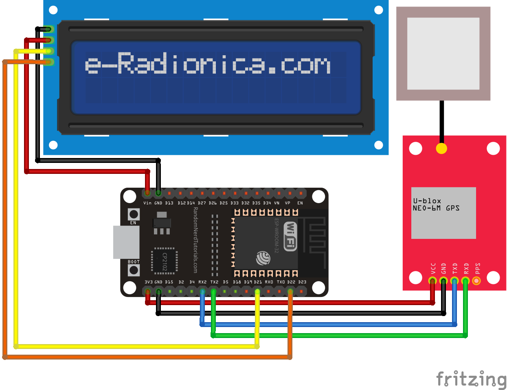

# Speed_Count_GPS_ESP32
Making a speedometer using ESP32 and GPS Module.  
Take a look at my repository before. [Link's here](https://github.com/samueljovial21/ESP32_GPS_Neo_6m.git).

## Wiring Diagram
### GPS Module
* VCC : 3v3 pin at ESP32  
* RX  : TX2 pin at ESP32  
* TX  : RX2 pin at ESP32  
* GND : GND pin at ESP32  
### LCD I2C
* VCC : VIN pin at ESP32  
* GND : GND pin at ESP32  
* SDA : 21 pin at ESP32  
* SCL : 22 pin at ESP32  

## Notes
You need to install TinyGpsPlus library first to your arduino IDE.  
You can add it by copying the TinyGPSPlus folder to your arduino IDE library.  
The common path is C:\Users\<username>\Documents\Arduino\libraries

## Output Example

